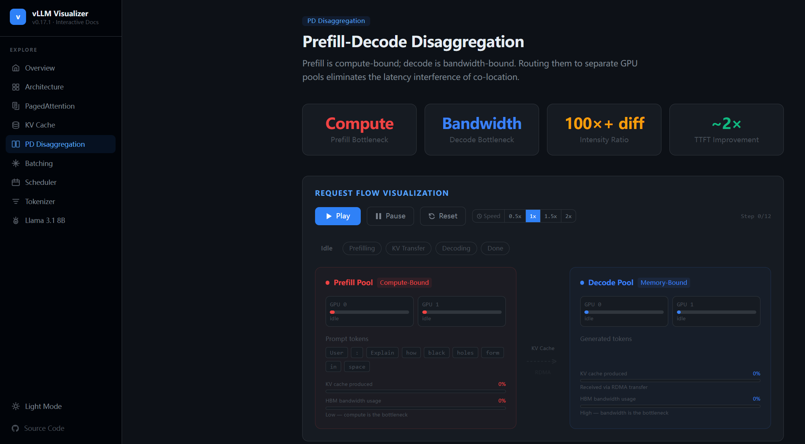

# vLLM Visualizer

An interactive, step-by-step visual guide to the internals of [vLLM](https://github.com/vllm-project/vllm) — the high-throughput LLM serving engine.



**Live demo:** [vllm-visualizer.vercel.app](https://vllm-visualizer.vercel.app)

---

## What's inside

| Page | What it covers |
|---|---|
| **Transformer Architecture** | Attention heads, FFN, residual connections, RMSNorm |
| **PagedAttention** | OS-inspired virtual memory for KV cache blocks |
| **KV Cache Management** | Non-contiguous storage, block tables, copy-on-write, prefix sharing |
| **PD Disaggregation** | Prefill vs decode bottlenecks, separate GPU pools, KV transfer via RDMA |
| **Continuous Batching** | Iteration-level scheduling vs static batching |
| **Scheduler & Preemption** | FCFS queues, swap vs recompute strategies |
| **BPE Tokenizer** | Byte-pair encoding visualized token by token |
| **Llama 3.1 8B Deep Dive** | GQA, RoPE, memory footprint, vLLM serving numbers |

All visualizations are interactive — use Play / Pause / Speed controls or click phase buttons to jump to any step.

---

## Running locally

```bash
git clone https://github.com/LeslieWongCV/vllm-visualizer.git
cd vllm-visualizer
npm install
npm run dev
```

Open [http://localhost:3000](http://localhost:3000).

## Stack

- [Next.js 14](https://nextjs.org) (App Router)
- [Framer Motion](https://www.framer.com/motion/) — animations
- [Tailwind CSS](https://tailwindcss.com) — layout and spacing
- CSS custom properties — GitHub Primer light/dark theme

## License

Apache-2.0
